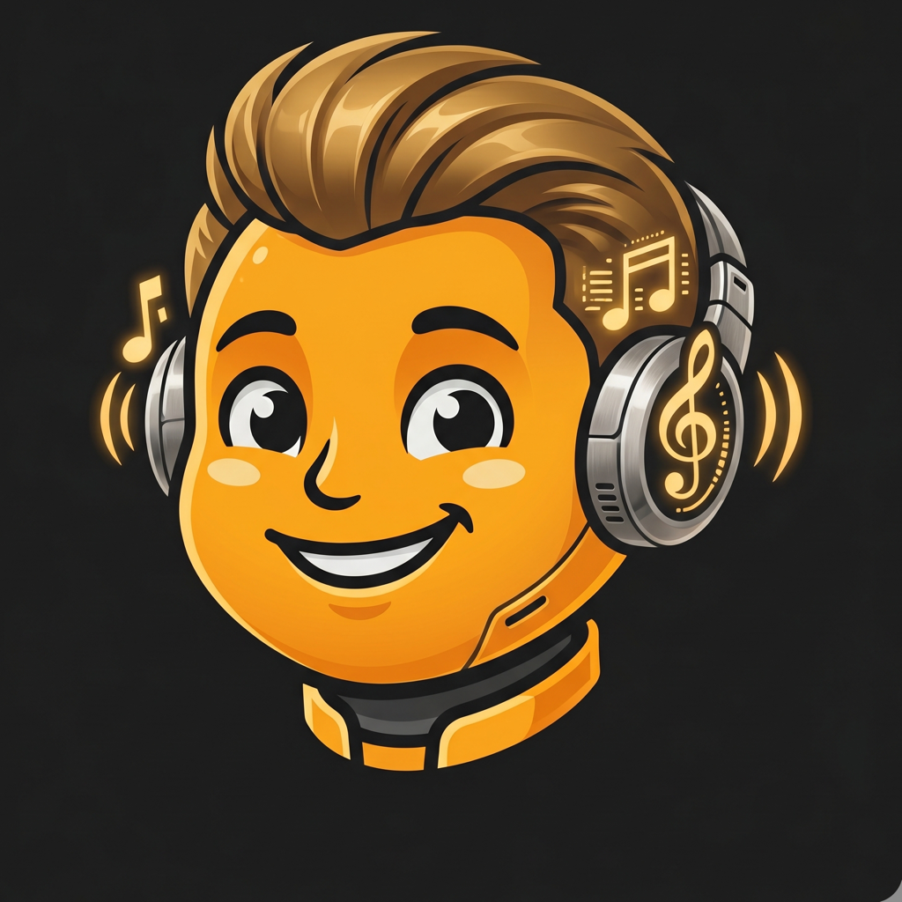

<p align="center">
  
</p>

<h1 align="center">Audie</h1>
<p align="center"><em>An ear training companion for guitarists with cochlear implants</em></p>

---

## What is Audie?

Audie is a macOS desktop app that closes a gap nobody else has tried to close: **ear training for active guitarists who use cochlear implants**.

Every existing ear training app assumes you hear the way a hearing person hears. Every existing CI music app treats you as a passive listener reconnecting with sound after implantation. Audie treats you as what you actually are — a practicing guitarist who already plays and wants to get better.

The core loop is simple: Audie plays an interval, you play it back on your guitar, Audie tells you what it heard. Over time it builds a confusion map specific to *you* — which intervals blur together, at which registers, for your particular implant profile — and uses that map to drill exactly the gaps that matter.

## Why we built this

CI users who play guitar have no useful tools. Tuner apps tell you whether you're in tune. Ear training apps tell you to identify intervals — but they assume you hear what they expect you to hear. The rehab world built for listeners. The instrument-practice world ignores CI users entirely.

Audie is honest about the perceptual reality of cochlear implants. It doesn't try to model CI perception internally — it just listens to what you actually played and tells you the truth.

A few CI-specific details that no other app handles:

- **Register awareness** — interval confusion patterns differ at higher and lower registers; Audie tracks this per bucket
- **Bluetooth streaming delay** — CI users who stream Mac audio directly to their processor via Bluetooth experience a connection activation delay when audio starts. Audie maintains a constant inaudible signal to keep the stream alive
- **Difficulty that adapts to you** — Audie starts easy and adjusts. If you're struggling, she offers to back off. If you're on a streak, she pushes harder

## Audie the companion

The app speaks in first person as Audie — warm, encouraging, slightly playful. Not a sterile drill tool. She notices when you're on a streak, when you're struggling, and when you've been away a while. She'll suggest switching exercises, easing the difficulty, or taking a break. She remembers your name.

## Exercises

| Mode | What you do |
|------|-------------|
| **Contour** | Higher, lower, or same? The simplest pitch discrimination exercise — good starting point for CI users new to structured ear training |
| **Identification** | Hear an interval played by the app, identify it by ear (Yes/No format, one interval in focus at a time) |
| **Intervals** | Play the displayed interval on your guitar — the mic grades your response in real time |

Each mode has 5 difficulty levels. Contour ranges from wide leaps (8–16 semitones, easy) down to half-step discrimination (1–3 semitones, hard). Identification grows the interval pool from 2 to 6 intervals as difficulty rises. Interval playback tightens the grading tolerance.

## Documents

| File | Contents |
|------|----------|
| [DESIGN.md](DESIGN.md) | Full product spec — problem statement, target user, CI-specific interval challenges, architecture decisions |
| [PLAN.md](PLAN.md) | Phase-by-phase development plan with current status |
| [LESSON_PRIMITIVES.md](LESSON_PRIMITIVES.md) | Design notes on exercise types and lesson structure |
| [LEARNINGS.md](LEARNINGS.md) | Technical and product decisions made along the way |

## Stack

- **Swift / SwiftUI** — macOS 13+, SPM-only (no Xcode project)
- **AudioKit** — audio engine, mic tap, pitch detection
- **AVFoundation** — sample playback, audio session management
- No backend, no account, no network — everything local

## Building

```bash
swift build
swift run EarTrain
```

Requires microphone permission on first launch.
